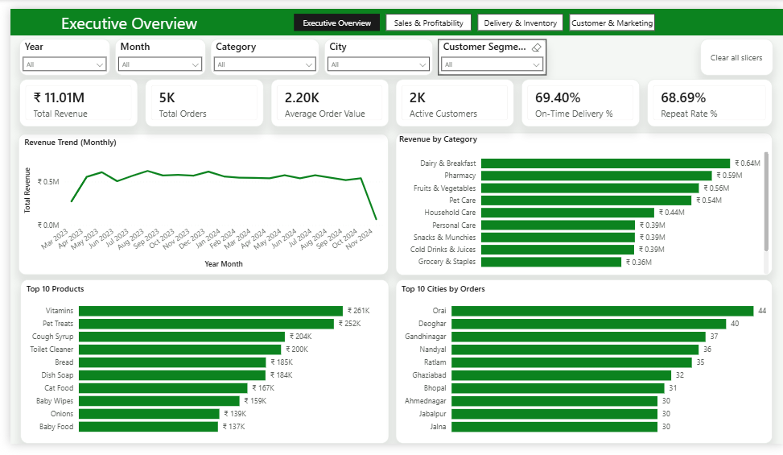
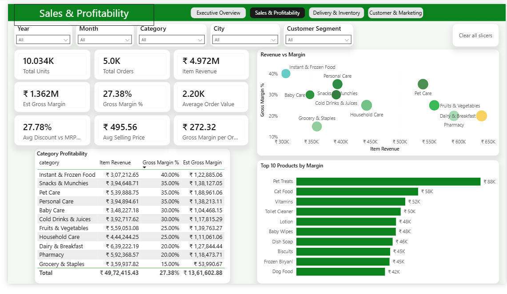
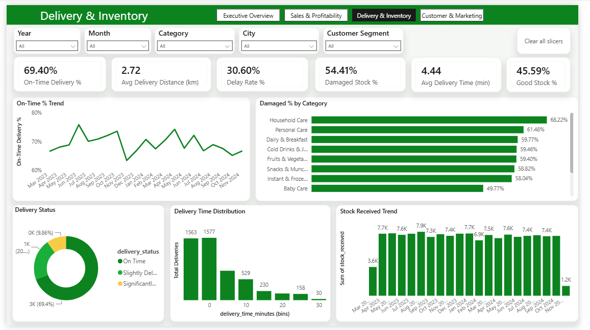
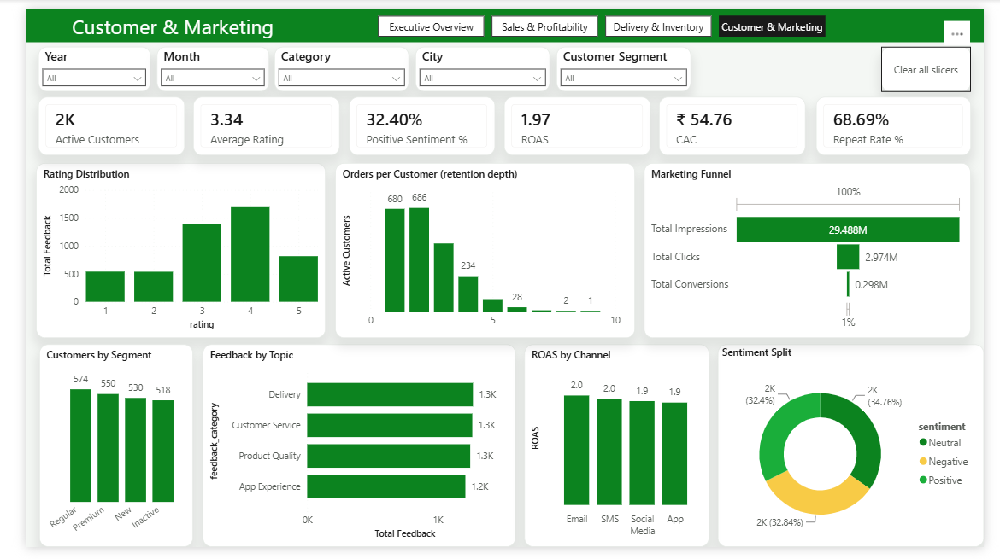

# Blinkit Quick-Commerce Analytics Suite — Power BI

A four-page, end-to-end business intelligence report built on a 9-table Blinkit retail dataset (~120K rows). The project covers the full BI workflow: **ETL in Power Query → dimensional data modeling → 45+ DAX measures → an interactive, themed 4-page report**, with a deliberate focus on **data validation** — several metrics were re-scoped or dropped after profiling revealed the source data couldn't support them.

> **Tools:** Power BI Desktop · Power Query (M) · DAX · Tabular Editor · Star-schema modeling
> **Domain:** Quick-commerce / q-retail (orders, delivery SLA, category profitability, customer retention, marketing funnel)



---

## In plain English

Blinkit is a 10-minute grocery delivery app. This dashboard answers the questions a Blinkit manager would ask every morning: *Are we growing? What's selling and is it actually profitable? Are we delivering on time? Do customers come back, and is our marketing worth it?*

I took nine raw CSV files, cleaned and connected them into one data model, wrote the calculations (revenue, margin, on-time %, repeat rate, ROAS, etc.), and laid them out across four pages so a non-technical person can read the story in a few seconds per page. Along the way I found that several columns in the data were unreliable (e.g., "damaged stock" was larger than "stock received" in 39% of rows), so instead of plotting nonsense I documented those issues and built the dashboard around the parts of the data that were trustworthy.

---

## Business questions answered

| # | Question | Page |
|---|----------|------|
| 1 | Are we growing — revenue, orders, customers, retention? | Executive Overview |
| 2 | What sells, and which categories/products are actually **profitable**? | Sales & Profitability |
| 3 | Are we hitting delivery SLAs, and is inventory healthy? | Delivery & Inventory |
| 4 | Do customers come back, and how efficient is acquisition? | Customer & Marketing |

**Headline numbers (full period, Mar 2023 – Nov 2024):** ₹11.0M revenue · 5,000 orders · ₹2,202 AOV · 2,172 active customers · 69.4% on-time delivery · 68.7% repeat rate · 27.4% blended gross margin · 1.97× ROAS.

---

## Data architecture

### Requirements
- **Functional:** slice every metric by date, category, city, and customer segment; compare categories on revenue *and* margin; track delivery reliability and customer retention.
- **Non-functional:** single-file `.pbix`, refreshable from CSV, sub-second interactions, readable by non-analysts.
- **Constraints:** synthetic dataset with known quality issues; no cost data at order grain; one-file deliverable.

### Model — star schema
A classic star: conformed **Date**, **Customers**, and **Products** dimensions feeding fact tables, with Marketing intentionally disconnected (campaign-grain data that doesn't join to orders).

```
                          ┌───────────────┐
                          │     Date      │  ← dimension (marked as date table)
                          └──┬─────────┬──┘
              1:*  ┌─────────┘         └──────────┐ 1:*  (+ inactive: registration_date)
                   │                              │
          ┌────────▼────────┐            ┌────────▼────────┐
   1:* ┌──┤     Orders      ├──┐ 1:1     │   Inventory     ├──┐ *:1
       │  │     (fact)      │  │         └─────────────────┘  │
       │  └────────┬────────┘  │                              │
┌──────▼─────┐     │ *:1  ┌────▼──────────┐         ┌─────────▼────┐
│ Customers  │     │      │   Delivery     │         │   Products   │
│   (dim)    │     │      │  Performance   │         │    (dim)     │
└──────┬─────┘     │      │    (fact)      │         └─────────┬────┘
       │ 1:*       │      └────────────────┘                   │ *:1
┌──────▼──────┐    │ 1:1                              ┌─────────▼─────┐
│  Customer   │    └─────────────────────────────────┤  Order Items  │
│  Feedback   │                                       │    (fact)     │
└─────────────┘                                       └───────────────┘

        ┌──────────────────────────┐
        │  Marketing Performance   │   ← disconnected (campaign grain, no order join)
        └──────────────────────────┘
```

### Grain & cardinality (the part that drove every design decision)

| Table | Rows | Grain | Key relationship |
|-------|------|-------|------------------|
| Date | 731 | one day | Date[Date] → Orders[order_date] (active) + → registration_date (inactive) |
| Customers | 2,500 | one customer | 1 → * Orders |
| Products | 268 | one product | 1 → * Order Items, Inventory |
| Orders | 5,000 | one order | 1:1 Order Items, 1:1 Delivery, 1:* Feedback |
| Order Items | 5,000 | one line (**1:1 with orders here**) | *:1 Products |
| Delivery Performance | 5,000 | one delivery | 1:1 Orders |
| Customer Feedback | 5,000 | one response | *:1 Customers / Orders |
| Inventory | ~75K | product × day | *:1 Products + → Date |
| Marketing Performance | 5,400 | campaign × day | **disconnected** |

### Key modeling decisions & trade-offs
- **Date dimension over auto-date** — one conformed calendar with sort keys (`Year Month Sort`) enables correct chronological axes and time intelligence; trimmed to the data's real range (2023–2024) to avoid empty slicer years.
- **Inactive `registration_date → Date` relationship** — activated with `USERELATIONSHIP` only inside the `New Customers` measure, so acquisition can be trended without disturbing the active order-date path.
- **Two revenue measures, on purpose** — `Total Revenue` (order grain) and `Item Revenue` (line grain) do **not** reconcile in this dataset (correlation ≈ 0), so they're kept separate and category analysis is explicitly labelled "item level." Documented, not hidden.
- **Marketing left disconnected** — it's campaign-grain with no foreign key to orders; forcing a join would fabricate relationships. Its visuals are intentionally not filtered by the global slicers.

---

## DAX measures (45+)

All measures live in dedicated **Measures** tables (hidden dummy column, business-friendly names, organized into display folders). Highlights:

**Core**
```dax
Total Revenue       = SUM ( Orders[order_total] )
Total Orders        = DISTINCTCOUNT ( Orders[order_id] )
Active Customers    = DISTINCTCOUNT ( Orders[customer_id] )
Average Order Value = DIVIDE ( [Total Revenue], [Total Orders] )
```

**Profitability** (margin varies 15–40% by category, so this is real signal)
```dax
Item Revenue     = SUMX ( 'Order Items', 'Order Items'[quantity] * 'Order Items'[unit_price] )
Est Gross Margin = SUMX ( 'Order Items',
                     'Order Items'[quantity] * 'Order Items'[unit_price]
                     * RELATED ( Products[margin_percentage] ) / 100 )
Gross Margin %   = DIVIDE ( [Est Gross Margin], [Item Revenue] )
```

**Retention** (FILTER over VALUES to count multi-order customers)
```dax
Repeat Customers = COUNTROWS ( FILTER ( VALUES ( Orders[customer_id] ),
                     CALCULATE ( DISTINCTCOUNT ( Orders[order_id] ) ) >= 2 ) )
Repeat Rate %    = DIVIDE ( [Repeat Customers], [Active Customers] )
```

**Acquisition** (inactive relationship)
```dax
New Customers = CALCULATE ( DISTINCTCOUNT ( Customers[customer_id] ),
                  USERELATIONSHIP ( Customers[registration_date], 'Date'[Date] ) )
```

**Top-N tiebreaker** — order counts tie heavily across 316 cities, so a composite measure makes the ranking unique while staying order-dominant:
```dax
City Rank (Orders) = [Total Orders] + DIVIDE ( [Total Revenue], 1000000000 )
```

Other groups: delivery (On-Time %, Delay Rate, Avg vs Promised), inventory (Damaged %, Good Stock %), marketing (ROAS, CTR, Conversion Rate, CAC), and time intelligence (Revenue MoM %, YTD).

> The full measure pack ships as a **Tabular Editor C# script** (`Create_All_Measures.csx`) that creates every measure with format strings and display folders in one run.

---

## Design system

Documented per design-token discipline so the look is consistent across all four pages. Applied via a custom `blinkit_green_theme.json`.

### Tokens

| Token | Value | Use |
|-------|-------|-----|
| Brand / Primary | `#0C831F` (Blinkit green) | KPIs, bars, lines, header band |
| Accent | `#F8CB46` (Blinkit yellow) | secondary series, highlights |
| Semantic — good / bad | `#0C831F` / `#E03131` | conditional formatting deltas |
| Surface | `#FFFFFF` card / `#F4F7F4` canvas | elevation |
| Text | `#1A1A1A` primary / `#5A5F5A` secondary | hierarchy |
| Radius | `12px` | card corners |
| Elevation | soft outer shadow, 12px blur @ 8% | card lift |
| Type | Segoe UI — value 24–30, title 12–14, label 10 | scale |
| Grid | 1280×720 canvas, 8px spacing unit | layout |

### Components
- **KPI card** — Card (new) visual: callout value + category label, fixed 196×92, six per row.
- **Slicer (dropdown)** — uniform 5-up filter bar, header on, synced across pages.
- **Charts** — green sequential for single series; semantic green/red only where meaning is encoded; never rainbow.

### Patterns
- **Top filter bar** — slim horizontal strip under a green title band; the industry-standard exec layout (KPIs keep the top-left reading start). Slicers: Year, Month, Category, City, Customer Segment + a "Clear all slicers" bookmark button.
- **Page frame** — identical green header (title + page-navigator buttons) and filter bar on every page; the repetition is what reads as "designed."
- **Reading rhythm** — KPI strip → trend/headline → breakdowns, top to bottom.

---

## The four pages

**1 · Executive Overview** — 6 KPIs (Revenue, Orders, AOV, Active Customers, On-Time %, Repeat Rate) + Revenue trend, Revenue by Category, Top 10 Products, Top 10 Cities (with the Top-N tiebreaker).


**2 · Sales & Profitability** — 9 unit-economics KPIs + a **Revenue-vs-Margin scatter** (the standout: splits categories into protect / fix-margin / grow quadrants), a conditional-formatted Category Profitability table, and Top Products by *margin* (not revenue — a different list).



**3 · Delivery & Inventory** — delivery SLA KPIs + On-Time trend, delivery-status donut, a **delivery-time histogram** (custom 5-min bins), Damaged % by Category, and Stock Received trend. No partner analysis (see data quality).



**4 · Customer & Marketing** — CX + acquisition KPIs + rating distribution, sentiment split, feedback topics, customers by segment, an **Orders-per-Customer retention histogram** (visually proves the 68.7% repeat rate), ROAS by channel, and a marketing funnel (29.5M impressions → 2.97M clicks → 298K conversions ≈ 1%).



---

## Data quality & integrity findings

The part of the project I'm most deliberate about. Profiling (Python/pandas) surfaced issues that would have produced misleading visuals; each was handled, not ignored:

| Finding | Impact | Action |
|---------|--------|--------|
| `order_date` carried a **time component**; Date table held pure dates | line chart matched **0 rows** (blank) | cast to Date in Power Query → join fixed |
| `order_total` vs Σ(qty×price) **correlation ≈ 0** | order vs item revenue can't reconcile | two explicit measures; category analysis labelled "item level" |
| `delivery_partner_id` **unique per delivery** (1 each) | partner-performance analysis impossible | dropped the visual + drill-through |
| `damaged_stock > stock_received` in **39%** of rows | damage % is logically invalid | kept with a documented caveat; not used as a headline |
| `reasons_if_delayed` is **Traffic-only** | delay-reason chart is meaningless | replaced with delivery-status split |
| revenue **flat month-to-month** (CV 5.5%); hours flat | growth/seasonality views are noise | re-scoped to composition over trends |
| `brand` **267 unique / 268 products**; `store_id` unique per order | junk dimensions | excluded |
| Top-N order counts **tie heavily** across cities | "Top 10" returned 13 | composite tiebreaker measure |

**Takeaway:** the analyst's job is to know what *not* to plot. Scoping the report to the data's real signal is the senior decision in this project.

---

## Repo structure

```
├── Blinkit_Analytics_Dashboard.pbix   # the report
├── README.md                          # this file
├── MEASURES.md                        # measures data dictionary
├── data/                              # 9 source CSVs
├── screenshots/                       # page images
├── EDA.ipynb                          # profiling / data-quality checks (Python)
├── blinkit_green_theme.json           # custom Power BI theme
├── Date_Table.dax                     # one-paste calendar table
├── Create_All_Measures.csx            # Tabular Editor script — all measures
├── Add_New_Measures_And_Relationship.csx
└── docs/                              # build guide & re-architecture spec
```

### Reproduce
1. Open `my_first_powerbi.pbix` (or load `data/*.csv` via Power Query).
2. Apply the type fixes (esp. `order_date` → Date).
3. New table → paste `Date_Table.dax`; mark as date table.
4. Run `Create_All_Measures.csx` in Tabular Editor.
5. Import `blinkit_green_theme.json` (View → Themes).

---

## Skills demonstrated
**ETL** (Power Query/M: type casting, locale-aware date parsing, dedup) · **Dimensional modeling** (star schema, cardinality, active/inactive relationships, `USERELATIONSHIP`) · **DAX** (`CALCULATE`, `SUMX`, `FILTER`/`VALUES`, `RELATED`, time intelligence, `DIVIDE` guards) · **Data visualization** (chart selection, histograms, quadrant scatter, funnel) · **Dashboard design** (design tokens, filter UX, theming) · **Data validation** (pandas profiling, integrity checks, scoping).

---

*Dataset is synthetic and used for portfolio purposes. Data-quality limitations are documented above by design.*
